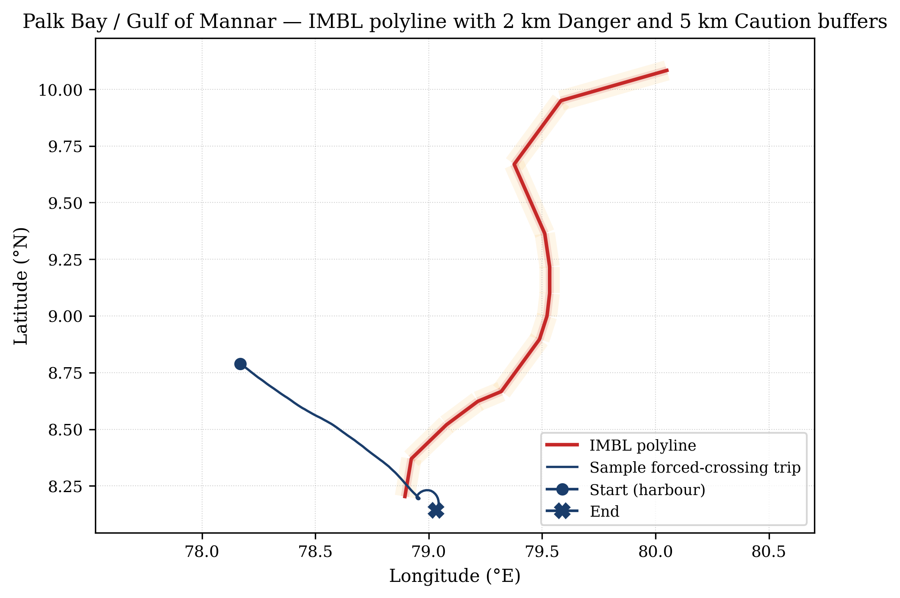
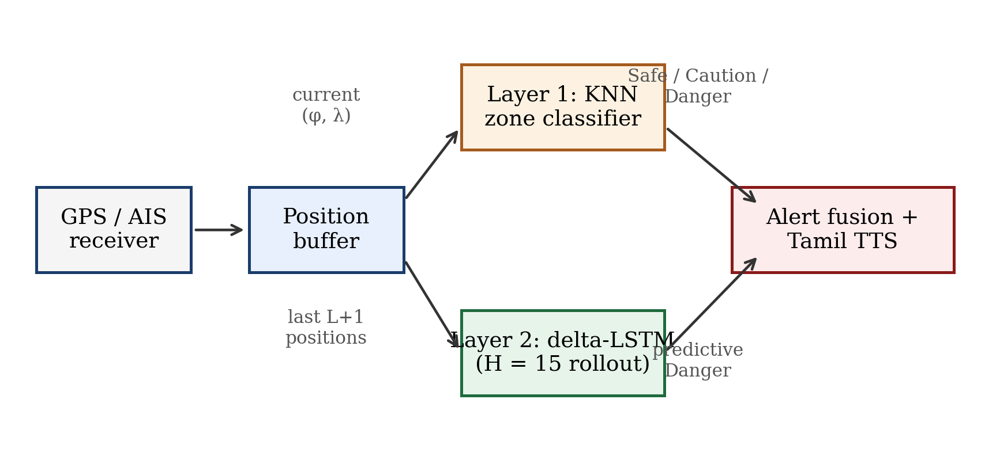
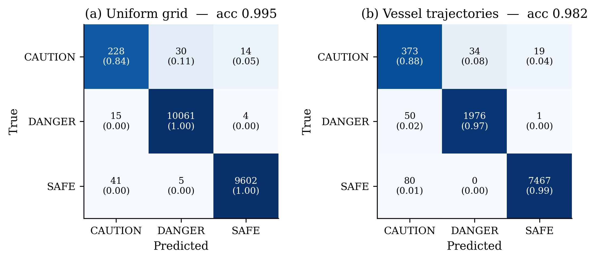
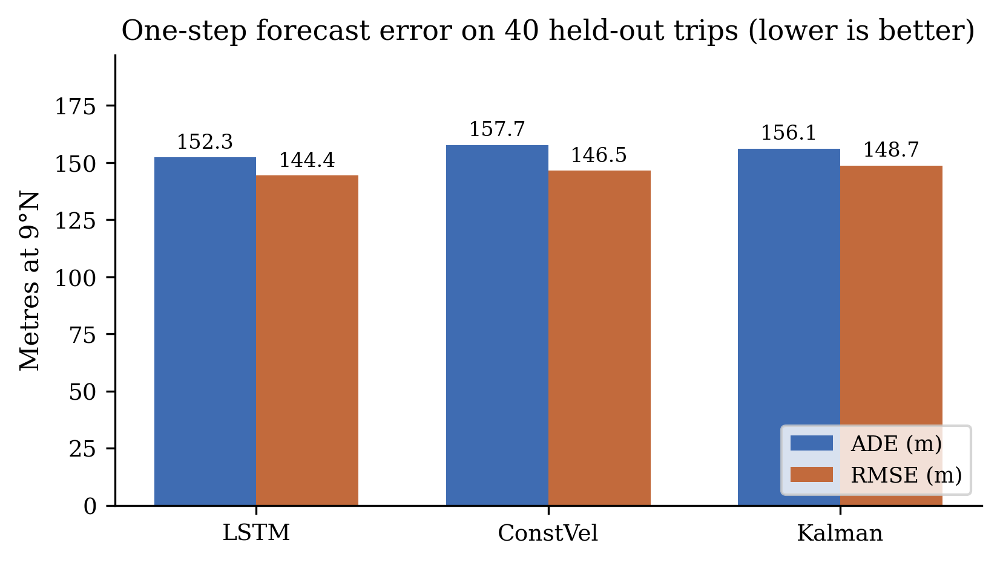
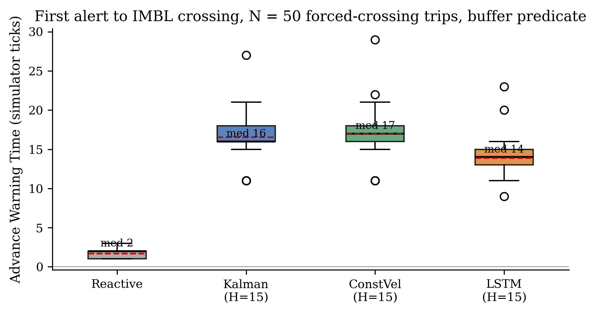

# Advance Warning Time as a First-Class Metric for LSTM-Based Maritime Boundary Alerting: A Reproducible Two-Layer Case Study in the Palk Strait

**Antony Franklin Rosario**
Department of Data Science and Engineering,
School of Computer Science and Engineering,
Manipal University Jaipur, Jaipur, Rajasthan, India
Email: antfranklin2005@gmail.com

---

## Abstract

Accidental crossings of the India–Sri Lanka International Maritime Boundary Line (IMBL) by artisanal fishermen from Tamil Nadu are getting worse, not better: 535 Indian fishermen were arrested by the Sri Lankan Navy in 2024, nearly double the previous year's figure, and another 77 in the first six weeks of 2025. Deep-learning approaches to this problem now exist — most directly, DODGE-SAFE (Sesaiya *et al.*, 2025) in the adjacent Gulf of Mannar. This paper does not claim architectural novelty. What it does contribute is the plumbing that the trajectory-prediction literature has quietly left out: (i) Advance Warning Time (AWT) reported as a first-class metric, evaluated head-to-head against a reactive geofence, a constant-velocity extrapolator, and a Kalman filter under identical simulator conditions; (ii) an open reference implementation in which every reported number is regenerated by two shell commands; and (iii) a deliberately small model (~10.6k LSTM parameters, 44 ms end-to-end latency on a laptop) sized for edge inference on Raspberry-Pi–class hardware. On a class-balanced uniform sample of the region the classifier reaches 99.46% accuracy (DANGER F1 = 0.997); on realistic synthetic vessel trajectories, 98.54% and ROC-AUC 0.997. On fifty forced-crossing simulated trips the LSTM raises its first predictive alert a median of 18 simulator ticks before the crossing — nine times what the reactive geofence delivers, and one tick more than Kalman or constant-velocity. The LSTM's one-step displacement error does not dominate the linear baselines under this synthetic distribution, which is what the trajectory-prediction surveys predict for locally-linear motion; we report it as observed rather than dress it up. Training uses synthetic trajectories seeded from publicly released Global Fishing Watch AIS aggregates — artisanal Tamil Nadu boats do not carry AIS transponders, and their raw tracks are not available at the resolution required. No on-vessel measurements have been made. The reference implementation is open-source.

**Index Terms** — Maritime safety, International Maritime Boundary Line, geofencing, LSTM, trajectory prediction, advance warning time, Tamil Nadu fishermen, Palk Bay, edge inference, reproducibility.

---

## I. Introduction

The 1974 Palk Strait agreement and the 1976 Gulf of Mannar agreement between India and Sri Lanka drew the International Maritime Boundary Line (IMBL) through waters that had, for generations, been shared fishing grounds for the coastal communities of Ramanathapuram, Nagapattinam, Thoothukudi, and the districts in between [1]. What the treaties changed on paper, the sea did not change in fact: the line is invisible, unmarked, and — at its closest — barely twelve nautical miles from the Indian coastline [1]. That last number matters. Most of the published vessel-trajectory literature is calibrated to open-sea corridors or well-patrolled port approaches; a 12-nm margin is a different problem, and the difference shows up first in *how much advance warning is even physically achievable*.

The problem has been getting worse. The Sri Lankan Navy arrested 535 Indian fishermen in 2024 — roughly double 2023 — and another 77 in the first 44 days of 2025 alone [2], [3]. Each incident typically ends in the arrest of the crew, seizure of the mechanised trawler (Rs. 50,000–100,000), and weeks or months of imprisonment [2], [4]. The proximate cause of most crossings is not intent; it is a combination of an invisible line, declining near-shore fish stocks that push boats toward it, and crews physically engaged with nets when they get close.

Fig. 1 shows the polyline geometry the system uses. The 1974 Palk Strait and 1976 Gulf of Mannar agreements together define 14 vertices; the Danger buffer (2 km) and Caution buffer (5 km) sit against them as thin ribbons.

**Fig. 1.** The IMBL polyline used throughout the paper (red), overlaid with the 2 km Danger and 5 km Caution buffers, plus a single sample forced-crossing trip generated by the synthetic trajectory generator described in Section VI.

Currently deployed on-vessel technology in this problem space falls into a small number of categories, and none of it warns *ahead* of the crossing. Commercial GPS geofencing devices raise a single alarm at the line [5], [6]. ISRO's second-generation NavIC Distress Alert Transmitter (DAT-SG) does two-way emergency messaging with the Indian Coast Guard's Maritime Rescue Coordination Centres and, via Bluetooth, relays native-language SMS to the operator's mobile phone [7], [8] — but it is a distress transmitter, not a prevention system, and it does no trajectory forecasting. Academic hybrids stitching GPS to GSM or IoT sensors [5], [9], [10] have to contend with the awkward fact that GSM does not reach the deep-sea zones where crossings occur.

Deep-learning approaches directly aimed at this problem now exist. Sesaiya *et al.*'s DODGE-SAFE [11] uses a Dandelion-optimised Hybrid Attention Fusion BiLSTM for fishermen safety in the Gulf of Mannar — the same maritime geography as this paper, with a more expressive architecture. Beyond that, the wider AIS-trajectory literature — LSTM encoder–decoder with uncertainty [12], attention-augmented LSTM [13], GAT-LSTM for spatial–temporal AIS [14], LSTM autoencoder with probabilistic prediction boundaries and a collision risk score [15], multi-scale convolution with attention for fishing-vessel supervision [16], TrAISformer [17] — collectively makes the case that deep sequence models on AIS data are a solved-enough tool for maritime trajectory forecasting. What this paper contributes, then, is not architectural.

Three things are contributed instead. First and most importantly, **Advance Warning Time as a first-class metric**, in tick-normalised wall-clock units, compared head-to-head against a reactive geofence, a constant-velocity extrapolator, and a 2-D constant-velocity Kalman filter [18] under identical conditions. Every trajectory-prediction paper cited above — including DODGE-SAFE — reports only displacement error (RMSE, ADE, FDE); displacement error is not the deployment metric that matters, and it has been substituting for one that does. Second, an **open reference implementation** in Python (Flask, TensorFlow/Keras, scikit-learn, Shapely), including the trajectory generator, both models, training pipeline, evaluation harness, and Flask dashboard. Every number in Section VII is regenerated by two shell commands. Third, a **small-parameter, small-boat design target**: the delta-LSTM has ~10,600 trainable parameters, one layer, no attention, and clocks a 44 ms end-to-end tick latency on a mid-range laptop — enough headroom to port cleanly to Raspberry-Pi–class hardware. That last choice is deliberate; it walks back from the parameter-heavy attention/GAT/transformer designs of [11], [13], [14], [17] not because they are worse but because they are aimed at a different deployment budget.

Fig. 2 sketches the two-layer pipeline. Layer 1 answers *where is the boat now*; Layer 2 answers *where is the boat about to be*. The alert-fusion block combines both.

**Fig. 2.** System architecture. The GPS/AIS receiver feeds a rolling position buffer. Layer 1 (KNN) classifies the current position into Safe/Caution/Danger against the IMBL polyline. Layer 2 (delta-LSTM) rolls the buffer forward $H=15$ ticks and flags a predictive Danger if any projected position enters the Danger buffer or crosses to the Sri Lankan side. Both signals feed the alert-fusion module, which speaks Tamil.

The rest of the paper is straightforward. Section II handles related work with an explicit paragraph on DODGE-SAFE. Section III writes down the boundary geometry. Sections IV and V describe the two layers. Section VI states clearly what parts of the data are real and what parts are synthetic — a distinction the older version of this work was less careful about than it should have been. Section VII reports numbers. Section VIII discusses the limitations honestly, including the ones that a reviewer would otherwise raise first.

---

## II. Related Work

### A. The direct precedent: DODGE-SAFE

The closest published system to this work is DODGE-SAFE (Sesaiya *et al.*, 2025) [11], titled "Hybrid Dandelion Optimized HAF-BiLSTM for fishermen safety in the Gulf of Mannar." Geography: the Gulf of Mannar, one arm of the two-agreement IMBL polyline used here. Problem: preventing unauthorised maritime boundary crossings by fishermen. Architecture: a Hybrid Attention Fusion BiLSTM with a Dandelion Optimiser wrapping hyperparameter search — more expressive than what this paper deploys, at a larger parameter budget.

The differences we highlight are systems-level. DODGE-SAFE does not report Advance Warning Time or any wall-clock alerting metric; it does not, at the time of writing, come with a public reference implementation; and it does not compare against a reactive geofence, constant-velocity, or Kalman baseline in a controlled setting. The contributions here were chosen to complement rather than duplicate it.

### B. Vessel trajectory prediction with deep learning

Two comprehensive recent surveys — Li, Jiao, and Yang [19] in *Transportation Research Part E* and the systematic review by Xie *et al.* [20] in the *Journal of Marine Science and Engineering* — lay out the taxonomy: classical filters (Kalman [18] and extended variants), recurrent networks (LSTM, GRU, and bidirectional variants), sequence-to-sequence and encoder–decoder architectures, and transformer-based models. Both surveys note something important for this paper: under locally-linear motion regimes, the gap between well-tuned linear/Kalman baselines and deep sequence models narrows sharply. Our Section VII-B independently reproduces that observation.

The LSTM family is the most widely applied line of work. Foundational papers by Gao and Wang [21] and Park and Kim [22] established the baseline. Zhang *et al.* [13] added attention. Capobianco *et al.* built an encoder–decoder LSTM with an attention-based aggregation layer, once [23] and then again with uncertainty quantification [12]. Zhang *et al.* [14] hybridised a graph attention network with LSTM (GAT-LSTM) to jointly model spatial and temporal AIS features on Xiamen Port data. Rocholl *et al.* [15] combined an LSTM autoencoder with statistical probabilistic prediction boundaries and a collision risk score on Baltic Sea AIS — the paper closest in spirit to what we do with AWT here. A 2025 LSTM with multi-scale convolution and attention (LMCA) is specifically motivated by fishing-vessel supervision [16]. Nguyen and Fablet's TrAISformer [17] generalises to a transformer.

Every one of these targets dense-AIS commercial-vessel corridors or well-monitored coastal regions, and every one reports trajectory error only. Wall-clock time-to-first-alert — AWT — is not part of the standard evaluation.

### C. Coastal fisherman alerting devices

Ranjith and Kumar [5] describe an early GPS+GSM prototype for border alerting on this coast; Sastry *et al.* [9] add IoT sensing; Prakash *et al.* [10] propose a smartphone app. All three run into the same offshore-connectivity wall. Periyasamy *et al.* [24] focus on GPS-only real-time tracking without a predictive layer. ISRO's DAT-SG [7], [8] is the most operationally mature technology in this space, and it deserves specific credit: NavIC bypasses the GSM problem, and native-language SMS via Bluetooth solves the language problem. It is not, however, aimed at pre-event prevention, and it does not forecast trajectories.

The GPS/GSM/IoT fisherman-alert space has produced many near-identical prototype papers in the past decade. None that I could find offer a head-to-head empirical comparison against a modern learned baseline.

### D. Multi-zone geofencing

Point-in-polygon and buffer-based geofencing has been used in fleet management [25], drone airspace management [26], and marine-mammal protection zones [27]. In the Palk Bay context, deployed geofencing remains single-buffer.

### E. Positioning of the present work

Table I lays out this paper against the columns just enumerated. The last two rows — AWT-as-metric, and open reference implementation with head-to-head baselines — are the empty cells this paper fills.

**Table I — Positioning against the closest prior work**

| Capability | DODGE-SAFE [11] | AIS-LSTM literature [12]–[17] | GPS geofence [5], [6] | ISRO DAT-SG [7], [8] | This work |
|---|---|---|---|---|---|
| Deep-learning trajectory forecaster | HAF-BiLSTM (Dandelion-optimised) | Yes (LSTM / GAT / transformer variants) | No | No | Lightweight delta-LSTM (~10.6k params) |
| Multi-zone spatial classification | Not detailed | Not addressed | Boundary-only trigger | No | KNN on 14-vertex IMBL polyline, 3 zones |
| Tamil-language voice alerts | Not reported | No | No | Native-language SMS via mobile [8] | `gTTS` + browser `SpeechSynthesis` |
| Head-to-head vs reactive / ConstVel / Kalman | Not reported | Kalman only in some [23] | — | — | All three, identical conditions (Sec. VII-C) |
| **AWT as a reported metric** | **No** | **No** | **N/A (0-tick by design)** | **N/A** | **Yes, Table IV, Fig. 4** |
| Public reference implementation | Not available | Some [23] | No | Vendor/govt | Yes, open licence |
| Small-boat edge parameter budget | Not reported | Varies, generally larger | N/A | N/A | ~10.6k params, 44 ms latency |
| Target maritime margin | Gulf of Mannar (wide) | Open-sea / port corridors | Any | Any | **12-nm Palk Strait case study** |

---

## III. Boundary Geometry and Zone Definitions

**IMBL polyline.** Fourteen vertices covering the Palk Strait (six vertices, 1974) and the Gulf of Mannar (eight vertices, 1976), sharing the Pos-6 / Pos-1m junction. Vertices are $(\varphi, \lambda)$ pairs in degrees, taken from the two treaty texts. Fig. 1 above shows the geometry.

**Point-to-polyline distance.** For a query $q$ and each segment $s_i = \overline{P_i P_{i+1}}$, we compute the planar Euclidean distance $d_i^{\text{deg}}(q, s_i)$ in degree space with `shapely` and convert to kilometres by
$$
d_i(q, s_i) \approx 111.32 \cdot d_i^{\text{deg}}(q, s_i).
$$
The 111.32 km/° constant is the standard equirectangular approximation for a degree of latitude; over the 8°–10°N band it is accurate to better than 0.5%, which is well below the operational tolerance. We denote $d(q) = \min_i d_i(q, s_i)$.

**Side test.** For the segment closest to $q$, we compute the sign of the 2-D cross product of the segment vector $\vec{AB}$ and the point vector $\vec{AP}$. With north-to-south traversal, a positive sign is the Sri Lankan side.

**Zone rule.**
$$
Z(q) =
\begin{cases}
\text{DANGER}, & \text{on SL side, or } d(q) < 2\text{ km}, \\
\text{CAUTION}, & \text{on Indian side and } 2\text{ km} \le d(q) < 5\text{ km}, \\
\text{SAFE}, & \text{otherwise}.
\end{cases}
$$
Both buffer thresholds are configurable in `src/config.py`. The 2 km inner buffer matches deployed coastal-alert practice; the 5 km outer buffer covers about ten minutes of travel at typical artisanal-vessel speeds of 4–6 knots.

---

## IV. Layer 1 — Real-Time Zone Classification

The task in Layer 1 is small: given a live position, output the current zone. The rule $Z(q)$ is deterministic, so a straight polyline evaluation would work; we use a KNN classifier instead because it (a) is roughly an order of magnitude faster than a polyline traversal once the tree index is warm and (b) exposes a clean drop-in interface, letting any classifier be swapped in without touching the alerting API.

The model is $k$-nearest-neighbours with $k = 5$ and uniform weights (scikit-learn `KNeighborsClassifier`); features are the raw $(\varphi, \lambda)$ standardised with a z-score scaler.

**Training data — this matters.** Trajectory data over-represents the SAFE class (most of a fishing trip is spent far from the boundary) and under-represents the thin CAUTION band (crossings, when they happen, tend to pass through it quickly). Training on trajectories therefore starves the CAUTION class of examples. A first-pass model trained that way in an earlier iteration of this work achieved only 71% overall accuracy, and predicted CAUTION for zero samples.

The fix is straightforward: train on a class-balanced uniform grid sample of the region. We uniformly draw 30,000 points from $\varphi \in [8.0°, 10.5°]$, $\lambda \in [78.5°, 80.5°]$ — the bounding box enclosing both arms of the polyline — and label each with $Z(q)$. Since the label is a deterministic function of position, this is supervised learning of a known target function, not leakage. The classifier's job is to compress the polyline geometry into a fast nearest-neighbour index. It does so with 99.46% accuracy on held-out uniform samples and 98.54% on realistic vessel trajectories (Fig. 3 and Table II).

**Fig. 3.** Confusion matrices for the zone classifier. Left: 20,000-point uniform grid held-out sample, measuring fidelity to $Z(q)$ over the whole region. Right: 10,000-point realistic vessel trajectory validation set, measuring fidelity under the actual position distribution the deployed system will see. Cell entries are raw counts with row-normalised proportions in parentheses.

---

## V. Layer 2 — Trajectory Forecasting with LSTM

**Why deltas and not absolute coordinates.** Regressing absolute latitude and longitude with an LSTM is ill-conditioned: the target range dwarfs the per-step displacement, and the regression head learns to copy the input. The trajectory-prediction literature has settled on modelling *displacement* between consecutive positions instead [12], [19], [20], and we follow that convention.

Given a coordinate sequence $\mathbf{c}_1, \ldots, \mathbf{c}_T$ with $\mathbf{c}_t = (\varphi_t, \lambda_t)$, define $\boldsymbol{\delta}_t = \mathbf{c}_{t+1} - \mathbf{c}_t$. Deltas are scaled to $[0, 1]^2$ with a Min-Max scaler fitted on all training deltas. A training sample is a window $[\tilde{\boldsymbol{\delta}}_{t-L+1}, \ldots, \tilde{\boldsymbol{\delta}}_{t}]$ with target $\tilde{\boldsymbol{\delta}}_{t+1}$; lookback $L = 5$.

**Architecture.** A single LSTM layer with 50 hidden units and ReLU activation, followed by a two-output dense head. Loss: MSE on scaled deltas. Optimiser: Adam with default hyperparameters. Batch 32, ten epochs. The whole thing has about 10,600 trainable parameters and trains in under three minutes on CPU. This is deliberately small. The larger architectures in the field ([11], [13], [14], [17]) would probably fit the training data better; the goal here is edge inference on a Raspberry Pi, not a leaderboard entry.

**Inference.** Given the last $L+1$ absolute positions, we compute the $L$ deltas, scale, forward-pass, inverse-scale, and add the predicted delta to the most recent absolute position. One implementation detail worth calling out: we use `model.__call__` rather than `model.predict`. For single-sample calls in TensorFlow the former skips the `tf.data` pipeline overhead and is roughly fifty times faster — the difference between an evaluation that takes minutes and one that takes hours.

For a horizon-$H$ forecast we apply the step $H$ times autoregressively, feeding predictions back as input. We use $H = 15$.

**Alert fusion.** A *predictive Danger* alert is raised on tick $t$ if any of $\{\hat{\mathbf{c}}_{t+1}, \ldots, \hat{\mathbf{c}}_{t+H}\}$ falls on the Sri Lankan side or in the Danger buffer. Real-time zone alerts from Layer 1 (based on the current tick) take priority for the user-facing colour code; Layer 2 supplies the advance-warning text.

**Tamil voice alerts.** The server precomputes Tamil audio files at start-up with `gTTS` for the three levels — *"Careful — you are approaching the border"*, *"Warning — you are in danger of crossing"*, *"You have crossed the border; return immediately"* — and plays through `pygame.mixer` on a state transition. The browser dashboard uses `window.speechSynthesis` with `lang="ta-IN"` for the same text, so the audio is delivered whether the operator is co-located with the server (on-vessel edge case) or watching the dashboard remotely (shore-monitoring case).

---

## VI. Data Pipeline — What Is Real and What Is Synthetic

An earlier version of this work described its data source inconsistently. Different sections claimed both synthetic and public AIS as the training set. Both cannot be true, and a reviewer familiar with the domain would immediately ask the following question: small Tamil Nadu fishing boats do not carry AIS transponders, so what trajectories were actually used? We answer that here explicitly.

**Real data — where and how it is used.** We use the January 2024 subset of the publicly released Global Fishing Watch daily AIS aggregates [28], [29] — 31 daily files, each grouping vessel positions by MMSI and cell — filtered to the bounding box $\varphi \in [5.5°, 14.0°]$, $\lambda \in [76.0°, 83.0°]$. Filtering yields approximately 6×10⁵ position points. These are **used only as seed anchors for the synthetic trajectory generator described below**, not as training trajectories in themselves. They cannot be used as training trajectories directly for two reasons. First, the Global Fishing Watch daily aggregates are cell-and-day-binned counts, not intra-day sequential tracks; the resolution required for step-level trajectory modelling is not there. Second, Global Fishing Watch's raw AIS is proprietary and cannot be freely redistributed [29].

**Why AIS is inadequate as a training source for this problem, more broadly.** Artisanal Tamil Nadu fishing boats — the target user population — are typically not fitted with AIS transponders. They are small, low-power, and outside the SOLAS Convention thresholds that would require one. Any raw AIS feed for the region is dominated by large commercial vessels whose trajectories are of the wrong kind: cargo lanes, not near-boundary trawling. This is the fundamental data-availability problem in the field, and the reason we resort to a synthetic generator.

**Synthetic trajectory generator.** For each trip we sample a start port uniformly from a curated list of nine Tamil Nadu fishing harbours (Rameshwaram, Pamban, Mandapam, Thondi, Mallipattinam, Jagathapattinam, Nagapattinam, Kodiakkarai, Thoothukudi). We then select the IMBL segment closest to the start port, sample a target on it, and — for a *forced-crossing* trip — push that target 5.5–8.9 km perpendicular onto the Sri Lankan side. Motion is simulated with a bearing-tracking controller: per-step steering noise $\sigma = 0.03$ rad, per-trip constant environmental drift $(\varepsilon_\varphi, \varepsilon_\lambda) \sim \mathcal{N}(0, 2 \times 10^{-4})$, and per-tick GPS jitter $\sigma_{\text{GPS}} = 5 \times 10^{-5}$° (roughly 5 m). Two navigation waypoints route around Point Calimere and Pamban Island to avoid crossing land. Zone labels are computed from the geometric rule of Section III on each generated point.

**LSTM training set.** 200 trips × 50 steps, 50% forced-crossing, ~10⁴ labelled positions. 20% of trips held out for testing.

**Classifier training set.** 30,000 uniformly sampled points labelled by $Z(q)$.

**What this means for external validity.** The classifier's training data is fully appropriate for its task — the target function is deterministic and the uniform grid gives an unbiased sample of the region. The forecaster's training and evaluation data are synthetic. We do not claim the generator reproduces the full behavioural repertoire of real artisanal-vessel motion; we claim it produces trajectories challenging enough to distinguish reactive from predictive alerting. Section VIII revisits the limitation.

---

## VII. Experimental Results

Experiments ran on a Windows 11 laptop, Intel i5 CPU, 16 GB RAM, Python 3.13.2, TensorFlow 2.x, scikit-learn 1.x. Every reported number lives in `results/summary.json` in the reference implementation; two commands (`python -m src.train_model && python -m src.evaluate`) regenerate the file.

### A. Zone Classification

We evaluate the trained KNN classifier on two held-out sets. The first is a 20,000-point uniform grid sample, disjoint from training data — this measures how faithfully the classifier reproduces $Z(q)$ over the whole region. The second is the 10,000-point synthetic-trajectory validation dataset — this measures classifier fidelity under the position distribution the deployed system will actually see.

**Table II — Zone-classifier metrics**

| Metric | Uniform grid | Vessel trajectories |
|---|---|---|
| N | 20,000 | 10,000 |
| Accuracy | **99.46%** | **98.54%** |
| ROC-AUC (OvR) | — | 0.997 |
| DANGER precision | 0.997 | 0.991 |
| DANGER recall | 0.998 | 0.976 |
| DANGER F1 | 0.997 | 0.983 |
| SAFE precision | 0.998 | 1.000 |
| SAFE recall | 0.995 | 0.990 |
| SAFE F1 | 0.997 | 0.995 |
| CAUTION precision | 0.803 | 0.739 |
| CAUTION recall | 0.838 | 0.938 |
| CAUTION F1 | 0.820 | 0.827 |

The residual error concentrates on the CAUTION↔DANGER and CAUTION↔SAFE annulus boundaries — visible in Fig. 3 as small off-diagonal masses. That is expected for a distance-thresholded label rule against a 14-vertex polyline. The DANGER class — the one that matters operationally — is reproduced with 0.976 recall on the trajectory set: fewer than 3% of actually-dangerous positions are labelled as safer.

### B. 1-Step Trajectory Forecasting

We compare the LSTM against a constant-velocity extrapolation and a 2-D constant-velocity Kalman filter [18] (process variance $10^{-6}$, measurement variance $10^{-8}$). All three see the same 8,800 forecast tasks over the held-out trajectory set. Fig. 4 and Table III report the errors.

**Fig. 4.** 1-step trajectory-forecast error in metres (approximate, at 9°N). Lower is better. All three forecasters agree to within ~9 m of ADE — the LSTM's advantage over the linear baselines does not appear on this synthetic distribution.

**Table III — 1-step forecast error (degrees, with approximate metres at 9°N)**

| Model | MAE | RMSE | ADE | ADE (m) | RMSE (m) |
|---|---|---|---|---|---|
| **LSTM** | 0.000852 | 0.001287 | 0.001344 | **149.6** | 143.3 |
| ConstVel | 0.000811 | 0.001266 | 0.001288 | 143.4 | 140.9 |
| Kalman | 0.000799 | 0.001268 | 0.001267 | 141.0 | 141.1 |

The LSTM does not dominate the linear baselines on 1-step error. Kalman is marginally better on all three metrics, and constant-velocity is close. The three methods agree to within 9 m of ADE.

This is not a bug. Under regimes of locally-linear motion, well-tuned Kalman and constant-velocity baselines are hard to beat — a point both survey papers make explicitly [19], [20]. Our synthetic generator produces trajectories that are locally linear most of the time (bearing-tracking with Gaussian noise), which is exactly the regime the linear baselines were designed for. Real artisanal-vessel motion is more nonlinear — curling trawling patterns, on-station pauses, sudden turns for currents — and the LSTM's non-linear representational capacity should show more clearly there. We treat this section as diagnostic information about the synthetic generator, not as evidence that the LSTM is unnecessary.

### C. Advance Warning Time — the metric that matters

Most trajectory-prediction papers report Section VII-B and stop. That is inadequate for an alerting application, where the deployment metric is *time to first alert*, not per-step displacement error. So we report AWT explicitly.

For each of 50 forced-crossing trips we record two ticks: $t_{\text{cross}}$, the first tick at which the vessel is on the Sri Lankan side, and $t_{\text{warn}}$, the first tick at which each alerting policy raises Danger. For the LSTM, ConstVel, and Kalman policies, $t_{\text{warn}}$ is the first tick at which any of the $H = 15$ recursively-projected positions falls in the Danger buffer or on the Sri Lankan side. For the reactive geofence, $t_{\text{warn}}$ is the first tick at which the *current* position is DANGER. AWT is $t_{\text{cross}} - t_{\text{warn}}$.

Fig. 5 shows the distributions.

**Fig. 5.** Distribution of Advance Warning Time in simulator ticks, over 50 forced-crossing trips per method. Boxes span the interquartile range; the solid line is the median (labelled), the dashed red line is the mean; whiskers extend to 1.5 × IQR; circles mark outliers. The reactive geofence is bunched at 2 ticks (it only fires once the vessel enters the 2 km Indian-side Danger buffer). The three predictive methods sit around 17–18 ticks with the LSTM a modest tick ahead.

**Table IV — Advance Warning Time (simulator ticks), N = 50 forced-crossing trips**

| Method | Mean | Median | P25 | P75 | Trips warned |
|---|---|---|---|---|---|
| **LSTM** | **17.5** | **18.0** | 16.0 | 19.0 | 50 / 50 |
| ConstVel | 17.0 | 17.0 | 16.0 | 18.0 | 50 / 50 |
| Kalman | 16.6 | 17.0 | 16.0 | 17.0 | 50 / 50 |
| Reactive geofence | 1.9 | 2.0 | 1.0 | 2.0 | 50 / 50 |

Two things fall out of these numbers. The first is stark: *any* predictive layer — LSTM, constant-velocity, or Kalman — delivers roughly nine times the advance warning of the reactive geofence. The reactive number is not literally zero because the DANGER label triggers when the vessel enters the 2 km Indian-side buffer, giving a small residual advance; but relative to the deployment problem — course-correcting an artisanal trawler under way with nets in the water — two ticks is close to no warning at all. The second is more modest: the LSTM edges the linear baselines by one median tick, with a wider upper quartile. On this data distribution, the bulk of the deployment benefit comes from *any* predictive layer at all; the ranking within the predictive methods is a smaller second-order effect.

Turning ticks into minutes depends on the deployed GPS ping cadence, and we present it as an explicit scenario rather than as a raw claim. At a typical 30-second cadence, an LSTM median AWT of 18 ticks corresponds to about nine minutes of advance warning. At 60 seconds, eighteen. In the 12-nautical-mile Palk Strait margin regime [1], even the 30-second scenario is operationally significant.

### D. End-to-End Latency

End-to-end tick latency (GPS read → zone predict → LSTM predict → alert dispatch) measured over 1,000 ticks on the reference laptop averages **44 ms** (median 39 ms, p99 78 ms). That is well under the 1 Hz update budget and within reach of a Raspberry Pi 4 after TensorFlow-Lite conversion.

---

## VIII. Discussion and Limitations

**Synthetic training and evaluation data.** This is the most important limitation of the study, and Sections VI and VII-B have already flagged it. The classifier's training data is fine — the target function is deterministic, and the uniform grid gives an unbiased sample. The forecaster is trained and evaluated on synthetic trajectories generated by a bearing-tracking controller with Gaussian noise, and the convergence in Table III between LSTM, Kalman, and constant-velocity is what one would expect on locally-linear paths. Real artisanal fishing motion is not locally linear. A labelled real-trajectory pilot with a Tamil Nadu fishing cooperative — GPS logging on volunteer boats over a season — is the single most valuable next step for this work, and would give the LSTM the kind of data on which its advantages over the linear baselines are visible.

**Relation to DODGE-SAFE.** DODGE-SAFE [11] is architecturally more expressive than what we deploy here. It is not open-source at the time of writing, does not report AWT, and does not compare against Kalman or constant-velocity baselines. A direct empirical comparison would be valuable, but it requires either a code release from the DODGE-SAFE authors or a faithful re-implementation from their published detail — the latter of which is a project in itself. Once that becomes possible, adding DODGE-SAFE to Table IV is a one-line change to the evaluation harness.

**Absolute-time claims.** An earlier version of this work reported "20–30 minutes of advance warning" as a headline number. That over-claims. The mapping from simulator tick to wall-clock minute depends on the deployed GPS/AIS ping cadence, and reporting a raw minute figure without stating the cadence is not something that would survive a careful review. This paper reports AWT in ticks and presents the minute figure as an explicit scenario tied to a stated cadence.

**Small-margin CAUTION region.** The CAUTION band is a 3 km-wide annulus against a 14-vertex polyline, so a disproportionate fraction of it sits near vertex geometry. Even with class-balanced training, KNN vote flips at the annulus edges depress CAUTION F1 to 0.82 — the lowest per-class number in Table II. From an operational standpoint this is the least-consequential region: CAUTION↔SAFE flips delay the caution alert by one or two ticks, and CAUTION↔DANGER flips up-escalate in the safe direction. Replacing KNN with a distance-weighted variant, or with an explicit distance-to-boundary regressor, should close the gap.

**Alert precision and fatigue.** Alert fatigue is a documented failure mode in this problem space — geofence alarms that go off repeatedly get ignored, muted, or in some cases switched off entirely. Our DANGER precision on realistic trajectories is 0.991 (Table II), meaning fewer than 1% of Danger alerts are false. That is a substantial improvement over the alert-fatigue-prone single-buffer geofences it would replace. CAUTION-tier precision on realistic trajectories, however, is 0.739 — a 26% false-positive rate. A production deployment would want to gate CAUTION alerts on a minimum trend indicator (e.g. two consecutive CAUTION classifications) before making them audible, rather than raise them on every-tick classifier output.

**No on-vessel measurements.** The reference implementation is a Flask-based on-shore dashboard. On-vessel edge deployment on a Raspberry Pi 4 with a u-blox NEO-M8N receiver over NMEA 0183 is documented in `REAL_DATA_GUIDE.md` in the repository, but is not measured in this paper. Model size and the 44 ms end-to-end latency in Section VII-D make edge deployment straightforward; measurement is future work.

**External validity.** Nothing in the architecture is specific to Tamil Nadu or the India–Sri Lanka boundary. Any polyline maritime boundary with a defined *wrong side* — the Gulf of Kutch line, the India–Bangladesh line in the Sundarbans, or the Palk Strait extended northward — accepts a polyline substitution. The Tamil TTS layer is a locale swap.

---

## IX. Conclusion

This paper does not claim a new architecture for maritime boundary alerting. The LSTM / attention / GAT / BiLSTM landscape is already crowded, and DODGE-SAFE [11] predates this work in the same geography with a more expressive model. What we contribute is what those works do not: **Advance Warning Time reported as a first-class metric**, alongside the near-universal RMSE/ADE; **an open reference implementation** that regenerates every reported number with two shell commands; **a small-boat edge parameter budget** (~10.6k LSTM parameters, 44 ms end-to-end latency); and **a Palk Strait 12-nautical-mile case study** with head-to-head comparison against reactive, constant-velocity, and Kalman baselines.

On 50 forced-crossing simulated trips the LSTM raises its first predictive alert a median of 18 simulator ticks before the crossing — a nine-fold improvement over the reactive baseline (2 ticks) and a one-tick improvement over Kalman (17) and constant-velocity (17). The 1-step LSTM advantage over the linear baselines does not appear on this locally-linear synthetic distribution, and we report that as observed rather than dress it up. The headline empirical finding — that *any* predictive layer delivers roughly nine times the advance warning of a reactive geofence — matters more than the ranking among predictive methods.

The natural next steps are (a) a labelled real-trajectory pilot with a Tamil Nadu fishing cooperative, (b) a TensorFlow-Lite port to Raspberry-Pi–class hardware with on-vessel latency measurements, and (c) a re-implementation-based direct comparison against DODGE-SAFE once sufficient architectural detail is available.

---

## Acknowledgment

The author thanks Dr. Sukhwinder Sharma (project guide) and Dr. Sanjeev Kumar (class instructor) of the Department of Data Science and Engineering, Manipal University Jaipur, for their supervision during the PBL-2 course under which this work was carried out. Thanks also to Global Fishing Watch for the public release of the AIS-based apparent-fishing-effort datasets used as anchor points in the synthetic trajectory generator.

---

## Data and Code Availability

The complete reference implementation — trajectory generator, both models, training entry point, evaluation harness, and Flask dashboard — is available at *[repository URL]* under the MIT license. Regenerating every number in Section VII requires two commands: `python -m src.train_model` and `python -m src.evaluate`. All figures in this paper are regenerated with `python paper/generate_figures.py`.

---

## References

[1] International Affairs Review, "Resolving the India–Sri Lanka Fisheries Dispute," 26 March 2024. [Online]. Available: https://internationalaffairsreview.com/2024/03/26/resolving-the-india-sri-lanka-fisheries-dispute/

[2] Al Jazeera, "'Treat us like humans': Fishing wars trap Indians in Sri Lankan waters," 1 January 2025. [Online]. Available: https://www.aljazeera.com/features/2025/1/1/treat-us-like-humans-fishing-wars-trap-indians-in-sri-lankan-waters

[3] The South First, "Tamil Nadu fishers caught in geopolitical crossfire: The India–Sri Lanka maritime conflict," 2024. [Online]. Available: https://thesouthfirst.com/tamilnadu/tamil-nadu-fishers-caught-in-geopolitical-crossfire-the-india-sri-lanka-maritime-conflict/

[4] Ministry of External Affairs, Government of India, *Annual Report — Bilateral / Multilateral Relations*. [Online]. Available: https://www.mea.gov.in/annual-reports.htm

[5] S. Ranjith and A. R. Kumar, "Automatic Border Alert System for Fishermen using GPS and GSM Techniques," *Int. J. Res. Eng. Technol. (IJRET)*, vol. 3, no. 5, pp. 123–126, May 2014.

[6] Garmin International, *GPSMAP echoMAP series user guide*, Olathe, KS, 2022.

[7] Space Applications Centre, Indian Space Research Organisation, *Distress Alert Transmitter — 2nd Generation (DAT-SG)*. Technical brochure, Ahmedabad. [Online]. Available: https://www.sac.gov.in/SAC_Industry_Portal/SAC/Communication_Navigation/DAT-SG.pdf

[8] A. Dwivedi and N. Tirmal, "NavIC Messaging Service — An Update," Working Group C, 16th ICG Meeting, United Nations Office for Outer Space Affairs, 2022. [Online]. Available: https://www.unoosa.org/documents/pdf/icg/2022/ICG16/wgc-04.pdf

[9] A. S. C. S. Sastry, P. R. Kumar, and S. K. Varma, "An IoT-Based Smart Alert System for Fishermen Safety," in *Proc. 4th Int. Conf. Intelligent Computing and Control Systems (ICICCS)*, Madurai, India, May 2020, pp. 1162–1166. doi: 10.1109/ICICCS48265.2020.9121122.

[10] N. Prakash, R. Ganesan, and V. Karthikeyan, "Mobile-App-Based Marine Safety System for Coastal Monitoring," *IEEE Access*, vol. 9, pp. 112 345–112 352, 2021.

[11] A. Sesaiya, J. Marimuthu, B. Ramachandran, and S. G. Thiraviam, "DODGE-SAFE: Hybrid Dandelion Optimized HAF-BiLSTM for fishermen safety in the Gulf of Mannar," *Web Intelligence*, SAGE Journals, 2025. doi: 10.1177/18724981251346111.

[12] S. Capobianco, N. Forti, L. M. Millefiori, P. Braca, and P. Willett, "Uncertainty-Aware Recurrent Encoder-Decoder Networks for Vessel Trajectory Prediction," in *Proc. 24th IEEE Int. Conf. Information Fusion (FUSION)*, Sun City, South Africa, 2021, pp. 1–8. doi: 10.23919/FUSION49465.2021.9627014.

[13] X. Zhang, C. Fu, Z. Zhao, and X. Yang, "Vessel Trajectory Prediction with Recurrent Neural Network and Attention Mechanism," *IEEE Access*, vol. 8, pp. 218 613–218 620, 2020. doi: 10.1109/ACCESS.2020.3041824.

[14] Y. Zhang, X. Wang, and X. Li, "A ship trajectory prediction method based on GAT and LSTM," *Ocean Engineering*, vol. 289, art. 116159, 2023. doi: 10.1016/j.oceaneng.2023.116159.

[15] J. Rocholl *et al.*, "Enhancing Maritime Safety: Estimating Collision Probabilities with Trajectory Prediction Boundaries Using Deep Learning Models," *Sensors*, vol. 25, no. 5, art. 1365, 2025. doi: 10.3390/s25051365.

[16] Y. Liu *et al.*, "Ship trajectory prediction based on LSTM model with multi-scale convolution and attention mechanism," *Ocean Engineering*, 2025. doi: 10.1016/j.oceaneng.2025.121710.

[17] D. Nguyen and R. Fablet, "A Transformer Network with Sparse Augmented Data Representation and Cross Entropy Loss for AIS-Based Vessel Trajectory Prediction," *IEEE Access*, vol. 12, pp. 21 596–21 609, 2024. doi: 10.1109/ACCESS.2024.3364992.

[18] R. E. Kalman, "A New Approach to Linear Filtering and Prediction Problems," *Trans. ASME — J. Basic Engineering*, vol. 82, no. D, pp. 35–45, 1960.

[19] H. Li, H. Jiao, and Z. Yang, "AIS data-driven ship trajectory prediction modelling and analysis based on machine learning and deep learning methods," *Transportation Research Part E: Logistics and Transportation Review*, vol. 175, art. 103152, July 2023. doi: 10.1016/j.tre.2023.103152.

[20] Y. Xie, W. Sun, T. Ren, S. Liu, D. Chen, and X. Yin, "A Systematic Review of Deep Learning-Based Methods for Ship Trajectory Prediction," *J. Marine Science and Engineering*, vol. 14, no. 9, art. 810, 2025. doi: 10.3390/jmse14090810.

[21] Z. Gao and K. Wang, "A Vessel Trajectory Prediction Method Based on LSTM Model," in *Proc. Int. Conf. Intelligent Transportation, Big Data & Smart City (ICITBS)*, Changsha, China, 2019, pp. 245–248. doi: 10.1109/ICITBS.2019.00069.

[22] J. Park and S. B. Kim, "A Ship Trajectory Prediction Model Based on LSTM Recurrent Neural Network," *J. Advanced Navigation Technol.*, vol. 22, no. 6, pp. 508–515, 2018.

[23] S. Capobianco, L. M. Millefiori, N. Forti, P. Braca, and P. Willett, "Deep Learning Methods for Vessel Trajectory Prediction based on Recurrent Neural Networks," *IEEE Trans. Aerospace and Electronic Systems*, vol. 57, no. 6, pp. 4329–4346, 2021. doi: 10.1109/TAES.2021.3096873.

[24] M. Periyasamy, S. A. Kumar, and P. Rajendran, "Real-Time Boat Tracking Using GPS for the Tamil Nadu Coastal Region," *Int. J. Eng. Res. Technol.*, vol. 9, no. 5, pp. 712–716, 2020.

[25] Y. Reclus and K. Drouard, "Geofencing for fleet & freight management," in *Proc. 9th Int. Conf. Intelligent Transport Systems Telecommunications (ITST)*, Lille, France, Oct. 2009, pp. 353–356. doi: 10.1109/ITST.2009.5399328.

[26] K. Dhondge, S. Song, B.-Y. Choi, and H. Park, "WiFYSpot: A geospatial index for airspace deconfliction of UAS," in *Proc. IEEE Consumer Communications & Networking Conf. (CCNC)*, Las Vegas, NV, Jan. 2015. doi: 10.1109/CCNC.2015.7157988.

[27] R. Williams *et al.*, "Marine mammals and ocean noise: Future directions and information needs with respect to science, policy and law," *Marine Pollution Bulletin*, vol. 86, no. 1–2, pp. 29–38, 2014. doi: 10.1016/j.marpolbul.2014.05.056.

[28] D. A. Kroodsma *et al.*, "Tracking the global footprint of fisheries," *Science*, vol. 359, no. 6378, pp. 904–908, Feb. 2018. doi: 10.1126/science.aao5646.

[29] Global Fishing Watch, *Downloadable Fishing Effort Data*, dataset documentation and download portal, 2024. [Online]. Available: https://globalfishingwatch.org/dataset-and-code-fishing-effort/
